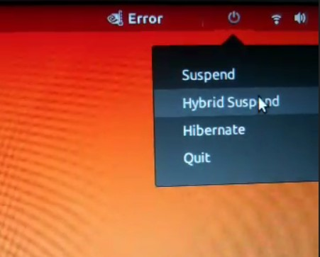

# suspend-panel

Suspend Panel is a Python script which, when added in Startup folder of Ubuntu gives functionality of Hibernate, Suspend, Hybrid Suspend.
Tech Stack: Gtk.

[Link to Video](https://drive.google.com/file/d/1jmXQpqvA4_kTqo9pCYcHPwnjwO8H1HFn/view?usp=sharing)
